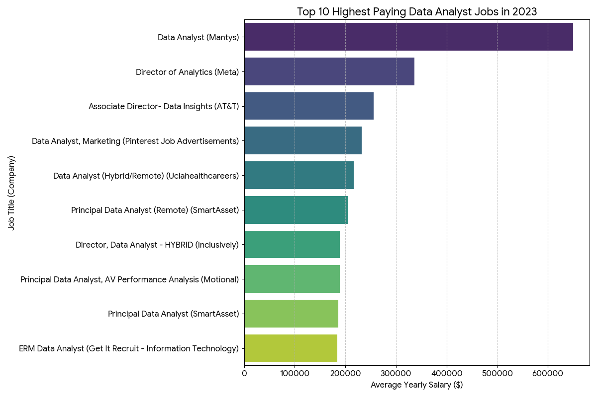
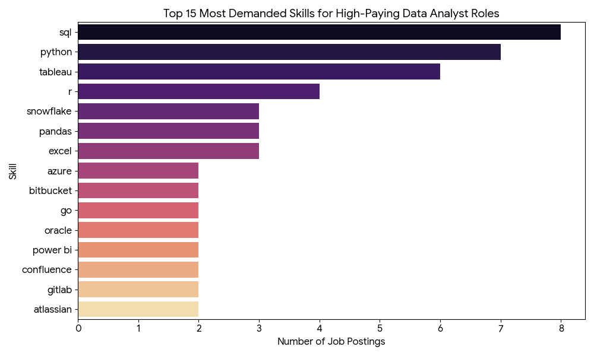
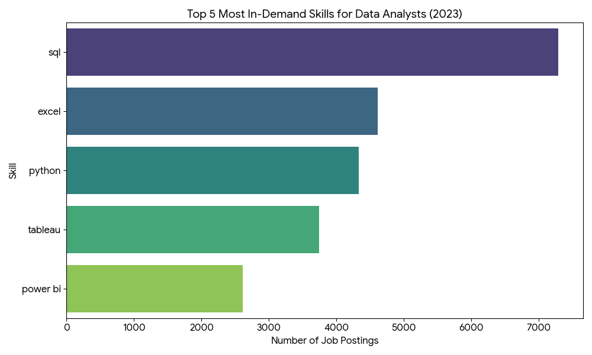
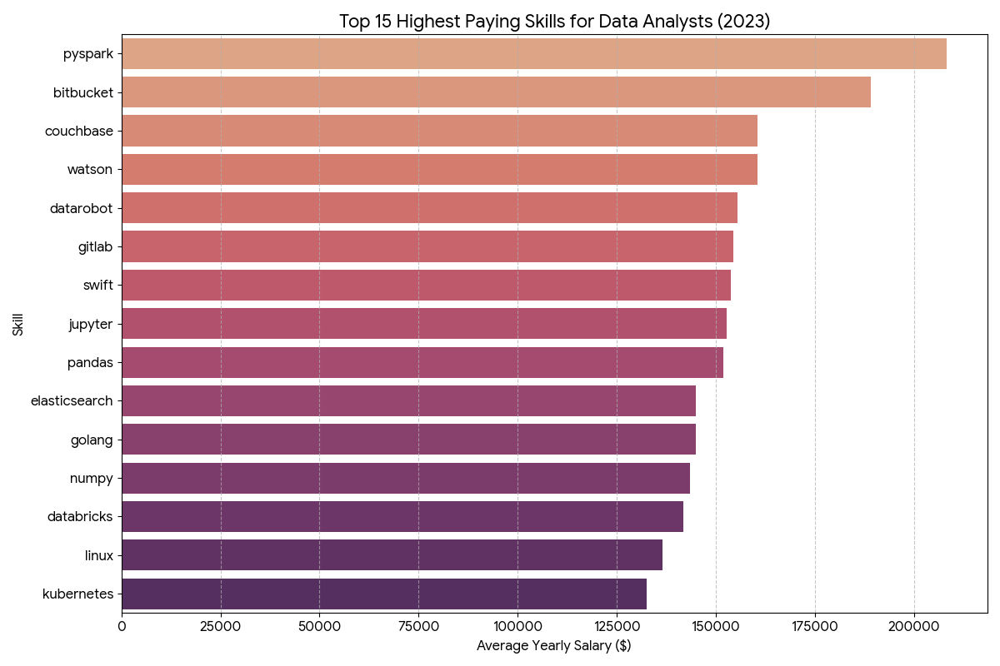
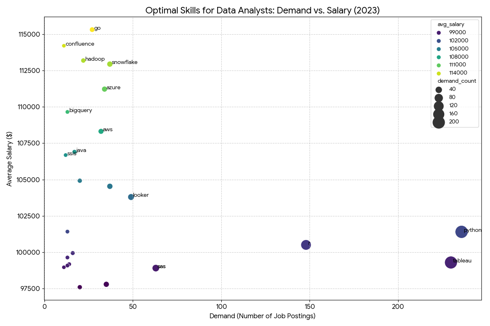

# Data Analyst Market Analysis: Top Paying Jobs & Skills

## 🚩 Introduction

What makes a Data Analyst highly paid? This project explores the intersection of job titles, companies, and technical competencies to uncover the most lucrative opportunities in the 2023 job market. From identifying  outliers to mapping out the most in-demand cloud tools, this analysis serves as a strategic guide for any data professional looking to maximize their career potential.

## 🔍 Background

The data for this project is sourced from a comprehensive collection of job postings. The primary goal was to answer five critical questions:

1. What are the top-paying Data Analyst jobs?
2. What skills are required for these elite roles?
3. Which skills are in the highest demand overall?
4. Which skills correlate with the highest average salaries?
5. What are the "optimal" skills to learn (high demand + high pay)?

## 🛠️ Tools I Used

To perform this analysis, I leveraged several key technologies:

* **SQL:** The backbone of the project, used to query the database, join tables, and aggregate data.
* **PostgreSQL:** The chosen database management system for handling the job posting datasets.
* **Python (Pandas/Matplotlib/Seaborn):** Used to visualize the SQL query results for clearer insights.
* **Git & GitHub:** For version control and sharing the analysis.

## 📊 The Analysis

### 1. Top-Paying Data Analyst Jobs

The analysis identified the top 10 highest-paying remote Data Analyst roles.

* **Salary Range:** Salaries range from **$184,000 to $650,000**, with an average of **$264,506**.
* **Top Earner:** **Mantys** is a significant outlier, offering a staggering ****.
* **Key Sectors:** High compensation is concentrated in **FinTech** (SmartAsset), **Social Media** (Meta, Pinterest), and **Telecommunications** (AT&T).

### 2. Skills for High-Paying Jobs

What do these  roles require?

* **The "Big Three":** **SQL** (8/10), **Python** (7/10), and **Tableau** (6/10) are the most critical.
* **Engineering Practices:** Top roles increasingly demand software engineering tools like **Git**, **Bitbucket**, and **Jira**.

### 3. In-Demand Skills

Looking at the entire market, these are the most frequently requested skills:

* **SQL** remains the undisputed king of data analysis, appearing in over **7,291 postings**.
* **Excel** (4,611) and **Python** (4,330) follow closely, representing the core technical stack for most analysts.

### 4. Top Skills Based on Salary

If you want to maximize your paycheck, focus on these:

* **PySpark** leads the list with an average salary of ****.
* Other high-paying technical skills include **Bitbucket** (), **Couchbase** (), and **Pandas** ().

### 5. Optimal Skills (The Sweet Spot)

Combining high demand and high pay, these are the best skills to learn for career stability and financial growth:

| Skill | Demand (Postings) | Avg. Salary ($) | Strategic Value |
| --- | --- | --- | --- |
| **Python** | 236 |  | Highest Versatility |
| **Tableau** | 230 |  | Visualization Standard |
| **Snowflake** | 37 |  | Cloud Data Premium |
| **Looker** | 49 |  | Modern BI Specialist |

## 💡 What I Learned

Through this project, I significantly sharpened my SQL skills:

* **Complex Joins:** Mastering the connection between job facts, company dimensions, and skill tables.
* **CTEs (Common Table Expressions):** Using `WITH` clauses to break down complex logic into manageable, readable parts.
* **Data Aggregation:** Using `GROUP BY` and `AVG` to derive meaningful financial insights from thousands of rows.
* **Market Awareness:** I learned that while foundational skills (SQL) get you the job, specialized skills (PySpark, Cloud) get you the high salary.

## 🏁 Conclusion

The 2023 data analyst market rewards both foundational strength and modern specialization. While **SQL** is mandatory for entry, the highest earners are those who bridge the gap between data analysis and software engineering using **Python**, **cloud infrastructure (Snowflake/Azure)**, and **Big Data frameworks**. For those looking to optimize their career path, the data suggests focusing on **Python** for its versatility and **Tableau** for its high demand, while layering on cloud-based skills to hit the six-figure bracket.
